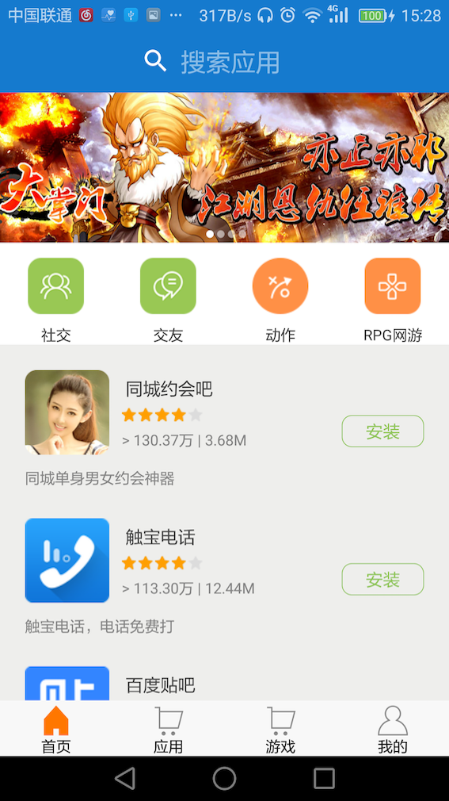
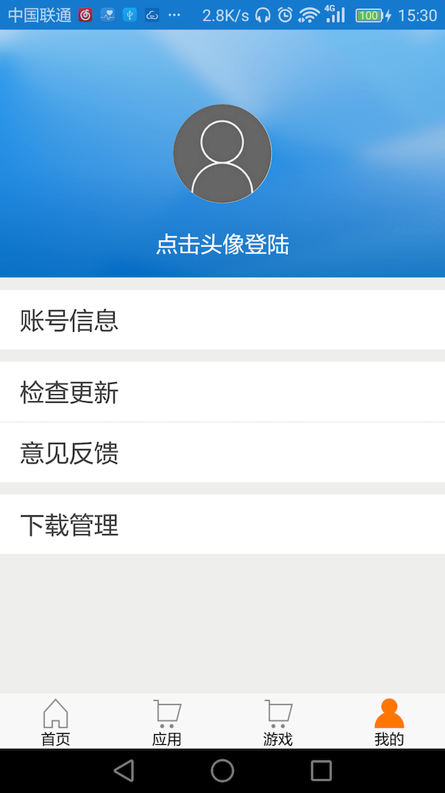

# DroiBaaSDemo-Android
本项目展示的是 DroiBaaS 相关功能

## 业务需求
### 一、用户系统
1. 建立用户系统
2. 提供注册/登录功能
3. 修改密码
4. 的上传头像/显示头像

### 二、首页banner展示
在首页展示一些banner信息用于活动推广等作用  
效果图如下：  


### 三、app信息list展示
在不同的界面展示不同的app list

### 四、搜索app功能
用关键字对应用进行简单的筛选

### 五、其他功能
其他功能主要放在我的页面中：登录功能入口、版本更新、用户反馈等。  
我的页面效果图如下：  


自更新效果图如下：  


## 方案选择

### 传统方案
传统方案需要服务端与客户端开发人员进行沟通，确定交互数据的协议格式。  
服务端负责：搭建业务服务器，进行服务端逻辑代码的编写，提供数据api接口给客户端调用。  
客户端负责：编写界面，使用api接口从服务端读取数据进行数据交互。  

### DroiBaaS方案

#### 一、用户系统
1. `DroiBaaS`提供了`DroiUser`类来帮助开发者建立用户系统
在这里介绍通过继承的方式使用`DroiUser`，这里我创建了一个类`MyUser`继承于`DroiUser`,在这个类中添加一些我们需要的属性，比如：address、headIcon等

    ``` java
    public class MyUser extends DroiUser {
        @DroiExpose
        private String address;
        @DroiExpose
        private DroiFile headIcon;

        public String getAddress() {
            return address;
        }
        public void setAddress(String address) {
            this.address = address;
        }
        public DroiFile getHeadIcon() {
            return headIcon;
        }
        public void setHeadIcon(DroiFile headIcon) {
            this.headIcon = headIcon;
        }
    }
    ```

2. 注册用户

    ``` java
    DroiUser user = new DroiUser();
    user.setUserId(email);
    user.setPassword(password);
    user.signUpInBackground(new DroiCallback<Boolean>() {
        @Override
        public void result(Boolean aBoolean, DroiError droiError) {
            showProgress(false);
            if (droiError.isOk()) {
                // 注册成功
            } else {
                // 注册失败，可以通过 droiError.getCode 获取错误码
            }
        }
    });
    ```

3. 登录

    ``` java
    DroiUser.loginInBackground(email, password, MyUser.class, new DroiCallback<DroiUser>() {
        @Override
        public void result(DroiUser droiUser, DroiError droiError) {
            showProgress(false);
            if (droiError.isOk()) {
                // 登录成功
            } else {
                // 登录失败，可以通过 droiError.getCode 获取错误码
            }
        }
    });
    ```

4. 修改密码

    ``` java
    String oldPassword = "oldPassword";
    String newPassword = "newPassword";
    // 一般从EditText获得
    DroiUser myUser = DroiUser.getCurrentUser();
    if (myUser != null && myUser.isAuthorized() && !myUser.isAnonymous()) {
        myUser.changePasswordInBackground(oldPassword, newPassword, new DroiCallback<Boolean>() {
            @Override
            public void result(Boolean aBoolean, DroiError droiError) {
                if (aBoolean) {
                    // 修改成功
                } else {
                    // 修改失败
                }
            }
        });
    }
    ```

5. 上传头像

    ``` java
    DroiFile headIcon = new DroiFile(new File(path)); //path 是图片路径
    MyUser user = DroiUser.getCurrentUser(MyUser.class);
    user.setHeadIcon(headIcon);
    user.saveInBackground(new DroiCallback<Boolean>() {
        @Override
        public void result(Boolean aBoolean, DroiError droiError) {
            if (aBoolean) {
                // 上传成功
            } else {
                // 上传失败
            }
        }
    });
    ```

6. 显示头像

    ``` java
    MyUser user = DroiUser.getCurrentUser(MyUser.class);
    if (user != null && user.isAuthorized() && !user.isAnonymous()) {
        if (user.getHeadIcon() != null) {
            user.getHeadIcon().getUriInBackground(new DroiCallback<Uri>() {
                @Override
                public void result(Uri uri, DroiError droiError) {
                    if (droiError.isOk()){
                        // 加载头像
                    }
                }
            });
        }
    }
    ```

#### 二、首页banner展示
通过`DroiBaaS`的web控制台可以创建`Banner`类，并且可以通过增加列的方式增加属性。
可以通过增加行的方式来添加一条数据。
然后需要在客户端创建一个类来对应于`DroiBaaS`云端的数据，如下：

``` java
public class Banner extends DroiObject {
    @DroiExpose
    private String appId;
    @DroiExpose
    private String imgUrl;

    public void setAppId(String appId) {
        this.appId = appId;
    }
    public void setImgUrl(String imgUrl) {
        this.imgUrl = imgUrl;
    }
    public String getImgUrl() {
        return imgUrl;
    }
    public String getAppId() {
        return appId;
    }
}
```

在客户端可以通过`DroiQuery`来查询保存在云端的数据，并且进行展示：

``` java
DroiQuery query = DroiQuery.Builder.newBuilder().limit(4).query(Banner.class).build();
query.runQueryInBackground(new DroiQueryCallback<Banner>() {
    @Override
    public void result(List<Banner> list, DroiError droiError) {
        if (droiError.isOk() && list.size() >0) {
            // 通知 view 更新
        } else {
            // 做请求失败处理
        }
    }
});
```

#### 三、app信息list展示
和`Banner`一样也需要通过`DroiBaaS`的web控制台可以创建`AppInfo`类，并且可以通过增加列的方式增加属性。
可以通过增加行的方式来添加一条数据。
然后需要在客户端创建一个类来对应于`DroiBaaS`云端的数据，如下：

``` java
public class AppInfo extends DroiObject {
    @DroiExpose
    private String appId;
    @DroiExpose
    private String icon;
    @DroiExpose
    private String name;
    @DroiExpose
    private int count;
    @DroiExpose
    private int rating;
    @DroiExpose
    private int size;
    @DroiExpose
    private String intro;
    @DroiExpose
    private String brief;
    @DroiExpose
    private String version;
    @DroiExpose
    private String apkUrl;
    @DroiExpose
    private String type;
    @DroiExpose
    private String mainType;
    @DroiExpose
    private String imageUrl;
    // setter/getter方法不列出
}
```

接下来在客户端可以通过`DroiQuery`来查询保存在云端的数据，并且进行展示：

``` java
DroiQuery query = DroiQuery.Builder.newBuilder().limit(10).offset(indexNum * 10).query(AppInfo.class).build();
/* 可以给查询设置不同的查询条件，查询不同类别的app等。
DroiCondition cond = DroiCondition.cond("mainType", DroiCondition.Type.EQ, "app");
DroiQuery query = DroiQuery.Builder.newBuilder().limit(10).offset(indexNum * 10).query(AppInfo.class).where(cond).build();
*/
query.runQueryInBackground(new DroiQueryCallback<AppInfo>() {
    @Override
    public void result(List<AppInfo> list, DroiError droiError) {
        refreshing = false;
        if (droiError.isOk() && list.size() >0) {
            // 通知 view 更新
        } else {
            // 做请求失败处理
        }
    }
});
```

#### 四、搜索app功能
这个功能用来根据关键字进行一些简单的筛选，同样是通过`DroiQuery`来查询。

``` java
// 通过Condition对字段的字符串进行一些筛选
DroiCondition cond = DroiCondition.cond("name", DroiCondition.Type.CONTAINS, appName);
DroiCondition cond1 = DroiCondition.cond("brief", DroiCondition.Type.CONTAINS, appName);
DroiQuery = DroiQuery.Builder.newBuilder().limit(10).offset(indexNum * 10).query(AppInfo.class).where(cond.or(cond1)).build();
query.runQueryInBackground(new DroiQueryCallback<AppInfo>() {
    @Override
    public void result(List<AppInfo> list, DroiError droiError) {
        refreshing = false;
        if (droiError.isOk() && list.size() >0) {
            // 通知 view 更新
        } else {
            // 做请求失败处理
        }
    }
});
```

#### 五、其他功能
其他一些功能可以通过在我的页面点击按钮来调用，也有一些功能可以在初始化时添加。  

1. 版本更新
在此工程中，总共在两处添加版本更新sdk。
一次是在应用进入时，在入口activity的onCreate中，添加了如下代码：

    ``` java
    DroiUpdate.update(this);
    ```
    还有一次是在我的页面中，通过手动点击的方式调用：
    ``` java
    @Override
    public void onClick(View v) {
        switch (v.getId()) {
            // 其他case
            case R.id.mine_frag_update:
                //手动更新
                DroiUpdate.manualUpdate(mContext);
                break;
        }
    }
    ```

2. 意见反馈
我们需要通过意见反馈来知道用户对应用的评价，通过点击进入反馈sdk的界面：

    ``` java
    @Override
    public void onClick(View v) {
        switch (v.getId()) {
            // 其他case
            case R.id.mine_frag_update:
                //手动更新
                DroiFeedback.callFeedback(mContext);
                break;
        }
    }
    ```

3. 消息推送
通过消息推送增加应用的日活，方便活动的推广等。只需在Application中添加一行代码即可实现：

    ``` java
    DroiPush.initialize(this);
    ```
